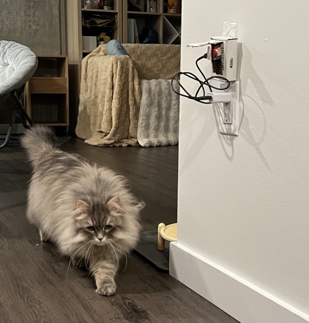
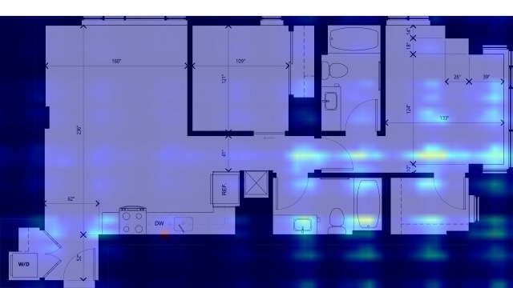

# Dander
<table>
  <tr>
    <td></td>
    <td></td>
  </tr>
  <tr>
    <td>正面</td>
    <td>侧面</td>
  </tr>
</table>
> I have two cats — one light, one dark. I sneeze every day. Vacuuming doesn't help much.
>
> The real culprit isn't the visible fur on the floor. It's Fel d 1, a protein secreted by cats that binds to microscopic dander particles (1–4 µm) and floats in the air for hours. Standard cleaning moves the problem around more than it solves it.
>
> I tried measuring it directly. My apartment's PM2.5 sits at 0–1 µg/m³ — clean enough that cat activity produces no detectable signal in mass concentration. But the particle *count* in the 1–4 µm range does respond. And the particle size distribution turns out to be a fingerprint: cooking fumes, dander disturbance, and ventilation events each have distinct spectral signatures across the six size bins the sensor reports.
>
> Dander is my attempt to actually understand what's moving through the air in my apartment — and build a system that can tell me why.

---

## What it does

Dander is a C++ system that reconstructs a continuous **multi-channel spatial field** from a sparse network of particle sensors placed around an apartment. Each sensor reports six particle size bins (>0.3, >0.5, >1.0, >2.5, >5.0, >10.0 µm) rather than a single PM2.5 number. A coordinate-based neural field maps `(x, y, t)` to this full spectral vector, producing a real-time heatmap of particle distribution overlaid on a floor plan — not just how much is in the air, but what kind, and where.

A secondary goal is **event detection and source localization**: identifying when something happened (cooking, ventilation, animal activity, fabric disturbance), where it originated, and how it propagated through the space. Each event type has a characteristic size distribution fingerprint and a spatiotemporal diffusion signature. The system uses these together to classify events without manual labeling during inference.

A third goal is **spatial optimization**: accumulating event histories to answer layout questions — which window ventilates which zone most effectively, where the dead zones are, how furniture and object placement (litter box, clothing storage, kitchen configuration) affects long-term air quality distribution across the apartment.

---

## Usage

### Prerequisites

Host side (macOS / Homebrew):
```bash
brew install cmake opencv sqlite onnxruntime nlohmann-json
```
Model training (Python, via uv):
```bash
uv venv && source .venv/bin/activate
uv pip install torch onnxscript onnx onnxruntime pandas matplotlib jupyterlab
```
Firmware: ESP-IDF (only needed to flash the ESP32 nodes).

### Build

```bash
cmake -S . -B build
cmake --build build
```
Targets: `dander-ingest` (UDP → SQLite), `dander-viewer` (live per-sensor markers),
`render_field` (reconstructed-field heatmap), plus unit tests (run with `ctest` from `build/`).

### Collect data and view it

`dander-ingest` and `dander-viewer` open `dander.db` relative to the working directory,
so run them from `build/`:
```bash
cd build
./dander-ingest      # binds udp/5005, writes incoming packets into readings
./dander-viewer      # live floor-plan view, one marker per active sensor
```

### Add a sensor

A node is one PMS7003M paired with one ESP32. Two steps:

1. **Flash the firmware** with this node's identity (ESP-IDF `menuconfig` → `DANDER` menu):
   ```bash
   cd firmware
   idf.py menuconfig
   #   DANDER_SENSOR_ID    (1–8)   unique id for this node
   #   DANDER_WIFI_SSID / _PASSWORD
   #   DANDER_SERVER_IP    the Mac running dander-ingest (default 10.20.77.1)
   #   DANDER_SERVER_PORT  (default 5005)
   idf.py flash         # over USB. (idf.py monitor only works over the serial cable.)
   ```
   After the first flash, firmware updates can be pushed over the air (OTA) — no cable needed.

2. **Register the node and its position** in the database. Coordinates are in meters;
   origin = top-left of the floor plan, +x right, +y down:
   ```bash
   sqlite3 build/dander.db
   ```
   ```sql
   INSERT INTO sensors (sensor_id, name, install_date) VALUES (2, 'S2', '2026-06-28');
   INSERT INTO sensor_locations (sensor_id, x, y, valid_from, valid_to)
       VALUES (2, 3.5, 5.7, <epoch_ms_now>, NULL);   -- epoch_ms_now = $(date +%s)000
   ```
   Locations are time-versioned: when you move a node, set `valid_to` on the old row and
   insert a new one. Historical readings stay attributed to the correct position.

Once flashed and registered, the node streams into `readings` and appears in the viewer.

### Retrain the model on new data

Readings accumulate in `dander.db` automatically while `dander-ingest` runs — there is
nothing to import by hand. To retrain the field on the latest data:
```bash
source .venv/bin/activate
jupyter lab          # open notebooks/skeleton.ipynb and run all cells
```
The notebook reads `build/dander.db`, trains the `(x, y, t) → 8-channel` field, and exports
the deployable artifact to `models/`:
```
models/dander_field.onnx        the computation graph
models/dander_field.onnx.data   the trained weights
models/dander_field.norm.json   normalization constants
```
> These three files are a single unit — they must travel together and be re-exported as a
> set. The C++ side loads all three; the `.onnx` alone (no weights, no constants) is useless.

To include more sensors, change the `sensor_id` filter in the notebook's `load_samples(...)`.

### View results

- **Live readings** (truthful — one marker per sensor, blank where no sensor exists):
  run `./dander-viewer` from `build/`.
- **Reconstructed field** (model heatmap over the floor plan): `./build/render_field`.
  Adjust the query time `t` and the channel index at the top of
  `src/viewer/render_field.cpp` to inspect different moments and size bins.

> With a single sensor the reconstructed field is not yet physically meaningful — it reflects
> the model's own structure, not real spatial spread. It becomes meaningful once several
> sensors are deployed simultaneously.

---

## Projects

### Project A — Multi-Channel Sparse-to-Dense Field Reconstruction

Eight sensors is far too sparse to understand room-level distribution. Project A trains a positional MLP on `(x, y, t) → [PM1.0, PM2.5, PM10, count_0.3, count_0.5, count_1.0, count_2.5, count_5.0]` mappings, learning the full spectral and spatial structure of airborne particle concentration in a specific living space. The trained model is exported to ONNX and runs inference in C++ at real-time rates.

The multi-channel output is analogous to a multi-channel feature map in CV: different size bins carry different physical information. The 1.0–2.5 µm count channel is the most relevant proxy for cat allergen carrier particles; the 0.3–1.0 µm channel tracks combustion byproducts; the 2.5–5.0 µm channel captures coarse skin and textile particles. Reconstructing all channels jointly allows the field to express event type spatially, not just concentration magnitude.

Key technical contributions:
- Coordinate-based neural field applied to multi-channel IoT sensor data
- Positional encoding to capture high-frequency spatial variation
- Inter-sensor bias correction across all spectral channels
- Benchmark against classical baselines: RBF interpolation, Kriging
- Structural analogy to dynamic NeRF: sparse observations → continuous spatiotemporal field

### Project B — Event Detection, Source Localization, and Spatial Optimization

Given the reconstructed multi-channel field over time, Project B addresses three problems:

**Event classification**: Each airborne event produces a characteristic (size distribution × diffusion shape) fingerprint. Cooking oil smoke is dominated by 0.3–1.0 µm particles with a sharp rise near S4 and rapid decay. Cat activity disturbance shifts the 1.0–4.0 µm count with a slower, multi-peak profile. Opening a window produces a directional wavefront propagating inward from the boundary. A lightweight classifier (trained on labeled events collected via an assisted-labeling dashboard) identifies event type from these joint features.

**Source localization**: Concentration wavefront arrival times across sensors, combined with the reconstructed field gradient, constrain the likely origin location via inverse diffusion modeling. This recovers approximate source positions without cameras or additional hardware.

**Spatial optimization**: Accumulated event histories enable layout recommendations grounded in observed data rather than simulation. Which window configuration produces the fastest whole-apartment flush? Does the litter box placement drive allergen toward the bedroom? Does the current kitchen layout create a corridor that channels cooking fumes into sleeping areas? Recommendations are generated by comparing observed diffusion outcomes under different boundary conditions (window open/closed states, time-of-day patterns) and expressing counterfactual improvements in terms of measurable metrics (time-to-clearance, peak exposure reduction).

Key technical contributions:
- Particle size distribution fingerprinting for event classification
- Inverse diffusion modeling for source localization
- Assisted event labeling pipeline: dashboard-triggered annotation with automatic tagging for deterministic events (cooking = manual trigger, window = contact sensor)
- Layout recommendation engine grounded in accumulated field statistics
- 24-hour dynamics: ventilation dead zones, sustained exposure windows by zone

---

## Technical stack

| Layer | Technology |
|---|---|
| Sensor interface | C++ UART reader, custom PMS5003 packet parser (all 12 output fields) |
| Data pipeline | UDP ingest (ESP32 → Mac), SQLite (WAL mode) time-series storage |
| Neural field training | Python, PyTorch, positional encoding |
| Edge inference | ONNX Runtime C++ API |
| Visualization | OpenCV heatmap rendering, floor plan overlay, event dashboard |
| Event labeling | Lightweight C++ dashboard with keyboard annotation triggers |
| LLM analysis (optional) | Claude API via HTTP client |
| Build system | CMake 3.20+, C++17 |

The C++ core handles everything from sensor ingestion through real-time inference and rendering. Python is used only offline for model training and export — no Python dependency at runtime.

---

## Hardware

| Component | Purpose | When needed | Est. cost |
|---|---|---|---|
| Plantower PMS5003 × 8 | Full-spectrum particle sampling (6 size bins) | Week 1 | ~$18–20 each |
| ESP32 DevKit V1 × 8 | Per-node microcontroller, WiFi, OTA | Week 1 | ~$3–5 each |
| Central compute (Mac M5 Pro) | Data aggregation, inference, visualization | Week 1 | already owned |
| USB hub / router | Node networking | Week 1 | ~$20 |
| Jetson Orin Nano (optional) | Standalone edge deployment | Week 7 | ~$150 |

Total hardware cost (without Jetson): ~$200.

Each node is a PMS5003 sensor paired with an ESP32. The ESP32 reads all 12 output fields over UART (3 mass concentration channels + 6 particle count channels + 3 diagnostic fields), connects to the home WiFi network, and streams readings to the central Mac via UDP. The ESP32's 5V output pin powers the PMS5003 directly, eliminating separate power supplies. OTA firmware updates are configured during Week 1, so node firmware can be updated remotely without physical access.

Sensor placement follows a coverage-plus-density strategy across a three-zone floor plan: open living room and kitchen (left), second bedroom and corridor (center), main bedroom (right), with bathrooms excluded. Node assignments: S1–S3 cover the living room; S4 is anchored near the stove as the cooking reference node; S5 covers the second bedroom; S6 covers the corridor; S7–S8 cover the main bedroom. All sensors are deployed at breathing height (~90 cm). One or two nodes are positioned near primary operable windows to anchor the neural field at ventilation boundaries.

---

## Timeline

### Week 1–2 — Infrastructure
- C++ UART reader for PMS7003M on ESP32; parse and validate all 12 output fields including all 6 particle count bins
- ESP32 firmware: WiFi station, SNTP time sync, UDP sender, OTA updates over double-slot partition
- Deploy 8 nodes; define room coordinate system from floor plan (units: meters, mapped to pixels at render time)
- SQLite schema, normalized into three tables:
  - `sensors(sensor_id, …)` — per-node metadata
  - `sensor_locations(sensor_id, x_m, y_m, valid_from, …)` — coordinates versioned over time so a node moving does not corrupt historical readings
  - `readings(sensor_id, epoch_ms, recv_ms, pm1/pm2.5/pm10, count_0.3/0.5/1.0/2.5/5.0/10.0, …)` — measurements with dual timestamps: `epoch_ms` from the ESP32 (SNTP-disciplined) for true sample time, `recv_ms` from the Mac for clock-drift analysis and packet-loss diagnostics
- WAL mode enabled so the ingest process and the OpenCV viewer process can read/write concurrently
- Real-time floor plan visualization with per-node spectral readout (OpenCV)
- Begin accumulating data; observe raw spatial and spectral patterns

### Week 3–4 — Project A core
- Inter-sensor bias correction across all spectral channels
- Implement RBF and Kriging baselines in C++
- Train multi-channel neural field (PyTorch): `(x, y, t) → 8-channel spectral vector`
- Export to ONNX; integrate ONNX Runtime inference in C++
- Benchmark: per-channel interpolation RMSE via leave-one-out evaluation

### Week 5–6 — Project B core
- Particle size fingerprinting: characterize cooking, ventilation, and disturbance event spectra
- Build assisted labeling dashboard; collect 50–100 labeled events
- Train event classifier on (spectral fingerprint × diffusion shape) feature vectors
- Source localization: wavefront arrival time analysis + gradient-based inverse diffusion
- Ventilation analysis: per-window diffusion patterns, dead zone mapping

### Week 7 — Spatial optimization and integration
- Layout recommendation engine: counterfactual analysis from accumulated event history
- End-to-end pipeline: sensor → inference → heatmap, latency profiling
- Optional: Jetson deployment, TensorRT INT8 quantization
- Optional: Claude API natural-language query interface ("why was my bedroom worse yesterday afternoon?")

### Week 8 — Delivery
- Quantified results: per-channel interpolation error, event classification accuracy, source localization error, fps
- Demo video: multi-channel heatmap live, cooking event detection and localization, before/after window opening
- Technical write-up (Project A methodology, Project B classification pipeline)
- README and reproducibility documentation

---

## What success looks like

At the end of eight weeks, Dander should be able to answer questions that were previously unanswerable without expensive equipment:

- Which room accumulates the highest sustained particle load in the 1–4 µm range (the primary allergen carrier band)?
- Does opening the north-facing window actually flush the apartment, or does it create a circulation pattern that leaves the bedroom untouched?
- How long after a cooking event does the kitchen-adjacent corridor return to baseline — and does it depend on which windows are open?
- Where should the litter box be placed to minimize its contribution to the bedroom's long-term particle load?
- What is the optimal window configuration for a 10-minute flush versus an overnight low-level ventilation strategy?

These are questions I actually want answered. Building the system to answer them is the project.
